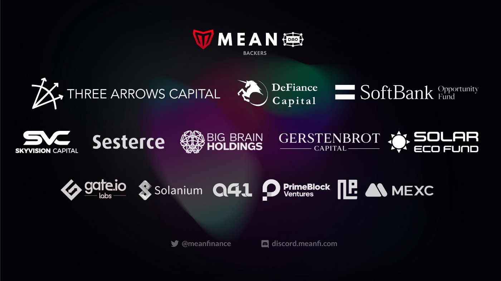

# 🫂 MeanDAO

## DAO Genesis

The Mean Finance Ecosystem formed MeanDAO on Dec 24th, 2021, with the objective of supporting the public goods protocols developed by the core team, namely the Token Streamer (aka Payment Streaming protocol) and the Solar Shield (aka Mean Multisig).

The core team relegated control of those protocols' parameters and revenue drivers to the DAO Governance and re-stated their alignment with the overall Mean Finance Mission. 

## One Metric

As a fully Decentralized Autonomous Organization with membership across the world and with products exclusively in the Solana Ecosystem, the DAO further focused its mission on a single metric:


Onboard and grow **business operational payments token volume** in Solana DeFi


Let's break that apart back to front.

1. **DeFi** = focused on DeFi, full-stop
   *  This also means not focusing on collectibles, games, etc.
2. **Solana** = focused on Solana DeFi, full-stop
   * This also means not focusing on Ethereum, Polygon, Bitcoin, etc.
3. **Token Volume** = focused on Solana DeFi Token Volume, full-stop
   * This also means not focusing on TVL, On/Off Ramp and Bridge Volume, # of Users, etc
4. **Business Operational Payments** = focused on business use cases with lots of volumes, like Payroll, Token Vesting for VCs, Business Loans, etc.
   * This also means not focusing on non-operational volume, like trading volume, P2P volume, remittance volume, etc.
5. **Onboard and Grow** = focused on bringing volume from newly onboarded businesses and growing volume from existing ones.
   * This also means not focusing on retail/individual users' volume.

## High Signal, Low Noise

The MeanDAO was formed during one of the worst periods of the crypto markets and was directly affected by some of its investors, who turned out to be bad actors. Our dear MEAN token and our  Treasury suffered when Three Arrows Capital went under, then when Defiance went under, and then one last time when Alameda/FTX went under. But we persevered and kept on building because our mission is worth keeping alive for the world because what we are doing matters on a human scale. 

Because we survived the school of hard knocks, we are unwavering in maintaining hyper-focus on the overall Mean Finance mission and filtering every idea and every move through the lens of that mission and our one metric. An idea should not be considered if it doesn't improve one of those two unless the proposal is to change our guiding principles and metric. 

Time is limited, and we vow not to waste ours on things that do not have a high probability of improving our <mark style="background-color:yellow;">**One Mission x One Metric**</mark>.&#x20;


**Mean Finance Mission:** To accelerate the world’s transition to decentralized finance ecosystems to bring economic equality and opportunity for individuals and organizations everywhere.

**MeanDAO Metric**: Onboard and grow business operational payments token volume in Solana DeFi.


## Founding Team

‌MeanDAO was founded by five long-term software entrepreneurs, cryptocurrency investors, and friends. They were Michel, Eydel, Yamel, Yansel, and Maylin. Joined by an enthusiastic community, we ventured into the unknown to build together and share ownership in the belief that meaningful value can be created when an ecosystem collaborates to build vs compete.&#x20;

As of Nov 2023, the MeanDAO is made of people from all corners of the world, and we are made of 12k+ MEAN token holders, over 1k sMEAN stakers and governance signers, and 54 active members who have submitted proposals directly on-chain.

## Known Investors

As a DAO, ownership is established by our token holders; and we have been fortunate to have the support of world-class investors and advisors, led by SoftBank, BigBrainHoldings, Gate.io, and DeFiance Capital, and others that will go down in history as the troubled ones, such as Three Arrows Capital and Alameda Research.&#x20;

Read our private round announcement [HERE](https://medium.com/mean-dao/mean-dao-brings-world-class-investors-onboard-to-revolutionize-the-banking-sector-and-build-the-c8bd4b7ed89b).

<figure><figcaption></figcaption></figure>
